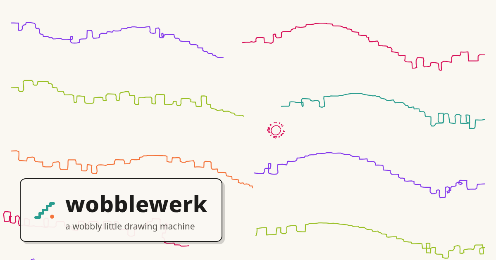

# Wobblewerk



A fun sketching **instrument**/toy — wobbly zigzags, hex-packed regions, sun glyphs. Free, web-based, and not a freeform drawing tool by any means.

## Features

* Move quick, scribble, inspire yourself, break things, undo.
* Procedurally generated strokes/paths: tweak the parameters before or after
* Opinionated color pallettes (six of them, from Ballpoint to Neon-on-black). Limitations are inspiring!
* Export to PNG for quick sharing, or SVG for further editing in Illustrator/Inkscape

## Sheets & dials

- **Sheet sizes**: New Sheet offers S / M / L in square, portrait, and landscape. Marks are fixed-size, so a Small sheet reads bold and chunky — and it renders true-to-size on screen (a Small sheet really is half a Large one; your PNG matches what you see).
- **hand** (global dial): 0 = ruler-clean, 1 = notebook tremor.
- **grain** (global dial): paper tooth, from smooth to speckled. Baked into SVG/PNG exports.

## Vibe Coded

Yes this was unapologetically vibe coded with Claude Fable 5 on xhigh effort. After an initial 20 minute spec session (shoutout to [superpowers](https://github.com/obra/superpowers) and [grill-me](https://github.com/mattpocock/skills)), the agent finished a near perfect final product in 4 hours and 23 minutes, overnight. 30 minute tweaking session and here we are.

## Shortcuts

| Key/Action | Purpose |
|---|---|
| `1` / `2` / `3` / `V` | Select zigzag / hexpack / sunstamp / select tool |
| `R` or [re-roll] | New seed for selected stroke (keep everything else) |
| `Delete` / `Backspace` | Delete selected stroke |
| `Esc` | Deselect |
| `Ctrl+Z` / `Ctrl+Shift+Z` | Undo / redo (snapshot history, 100 entries max) |
| `Ctrl+0` | Reset zoom (fit sheet to window) |
| Mouse wheel | Zoom (0.25× to 8×) |
| `Space` + drag | Pan viewport |

## Saving your work

Wobblewerk saves its native format to `.json` files.

- **Autosave** (~300ms debounce): stored directly in your browser. Open the page again sometime and it's still there. Refresh never loses work.
- **Save/Open**: download full `.json` or load one via file dialog.

### Export

- **SVG**: full drawing, palette colors baked in, opens cleanly in Inkscape.
- **PNG**: rasterized at 2× resolution. Optional clip to image boundaries.

## Brushes/Tools/Strokes Reference

Each stroke is a seeded recipe: change the seed, adjust up to 4 parameters, or re-color it.

### Zigzag (path tool — `1`)

Gesture-as-spine: axis-aligned staircase walk. The hand wobbles all horizontals/verticals.

- **runLength** (8–80 px, default 28): mean straight-run length
- **jaggedness** (0–1, default 0.5): variance + micro-step frequency
- **hug** (0–1, default 0.6): corridor tightness (1 = cling to spine, 0 = wander freely)
- **reversals** (0–1, default 0.15): probability of stuttering doubling-back

### Hexpack (region tool — `2`)

Click and drag a closed loop. The boundary is inked; the interior packs wobbly hexagons.

- **cellSize** (20–120 px, default 55): mean hexagon diameter
- **looseness** (0–1, default 0.4): packing irregularity (jitter, gaps, size variance)
- **nucleus** (0–1, default 0.3): probability each hexagon has a small oval core
- **simplify** (0–1, default 0.5): boundary smoothing (0 = raw loop, 1 = few straight edges)

### Sunstamp (point tool — `3`)

Click to place a sun: wobbly circle ringed by dots or dashes. Ghost preview follows your cursor.

- **size** (12–120 px, default 40): core circle diameter
- **ringDensity** (0–1, default 0.6): how many satellites ring it
- **ringDistance** (0–1, default 0.4): gap between circle and satellites
- **dashMix** (0–1, default 0.2): 0 = all dots, 1 = all dashes

---

## Development

```bash
npm run dev      # Start local dev server (Vite)
npm run test     # Run unit tests (Vitest)
npm run build    # Build for production
npm run preview  # Preview production build locally
npm run e2e      # Run end-to-end tests (Playwright)
```

Requirements: Node.js (modern, tested with asdf-managed versions).

---

Made with whimsy by [Travis Briggs](https://travisbriggs.com).

MIT License
